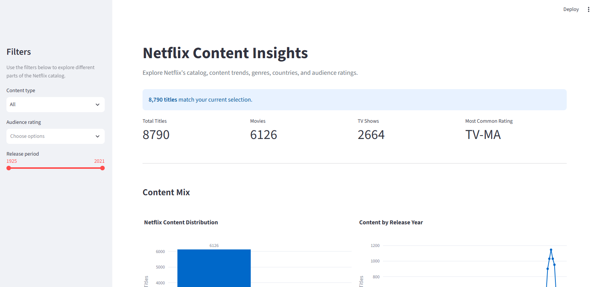
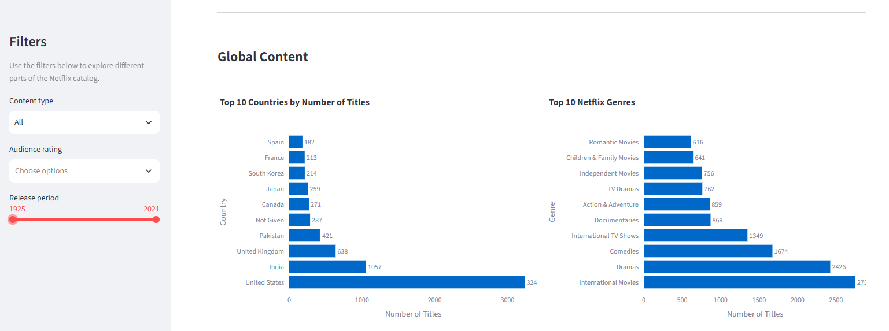
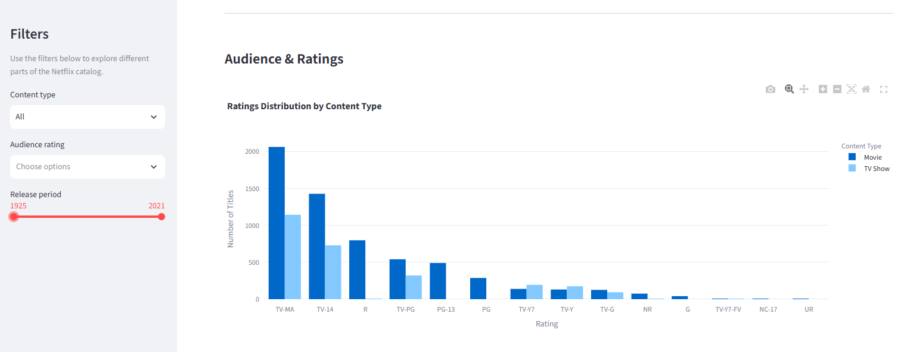
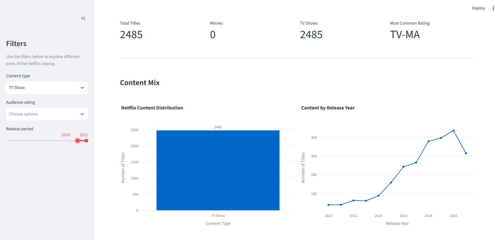

# Netflix Content Insights Dashboard

An interactive data analysis dashboard exploring Netflix's content catalog through Python, Pandas, Plotly, and Streamlit.

## Project Overview

This project analyzes a cleaned Netflix titles dataset containing **8,790 titles**.

The dashboard provides an interactive view of:

* Content distribution between Movies and TV Shows
* Content distribution by release year
* Top countries represented in the catalog
* Most common genres
* Audience rating distribution
* Differences in ratings between Movies and TV Shows
* Interactive filtering by content type, rating, and release period

## Objectives

The main objectives of this project were to:

1. Explore the structure and characteristics of the Netflix catalog.
2. Identify important content trends and patterns.
3. Analyze the distribution of genres, countries, and ratings.
4. Create an interactive dashboard for data exploration.
5. Present findings through clear visualizations and business-oriented insights.

## Dashboard

### Catalog Overview

The dashboard provides key metrics including total titles, Movies, TV Shows, and the most common audience rating.



### Global Content Analysis

The dashboard explores the distribution of Netflix titles across countries and genres.



### Audience Ratings & Insights

The dashboard compares audience ratings across Movies and TV Shows and summarizes the main findings.



### Interactive Filtering

Users can filter the dashboard by content type, audience rating, and release period.



## Key Insights

* Movies represent the majority of the Netflix catalog, accounting for approximately **70%** of the titles.
* **TV-MA** is the most common rating in the dataset.
* **International Movies, Dramas, and Comedies** are among the most represented categories.
* The release-year distribution shows a strong concentration of titles in the late 2010s, followed by a decline in the latest years represented in the dataset.
* Movies show a stronger representation of **R-rated** content, while TV Shows contain a greater representation of TV-specific ratings.

## Technologies

* Python
* Pandas
* Plotly
* Streamlit

## Project Structure

```text
netflix-content-insights-dashboard/
│
├── netflix_dashboard.py
├── netflix_cleaned.csv
├── README.md
└── screenshots/
```

## How to Run

Clone the repository:

```bash
git clone https://github.com/Glo-log/netflix-content-insights-dashboard.git
```

Navigate to the project folder:

```bash
cd netflix-content-insights-dashboard
```

Install the required libraries:

```bash
pip install pandas plotly streamlit
```

Run the dashboard:

```bash
streamlit run netflix_dashboard.py
```

The dashboard will open in your browser.

## Project Context

This project was developed as part of a **Data Analytics using Python internship project**.

The project demonstrates practical skills in:

* Data cleaning
* Exploratory data analysis
* Data visualization
* Interactive dashboard development
* Business insight generation
* Python-based data analysis
